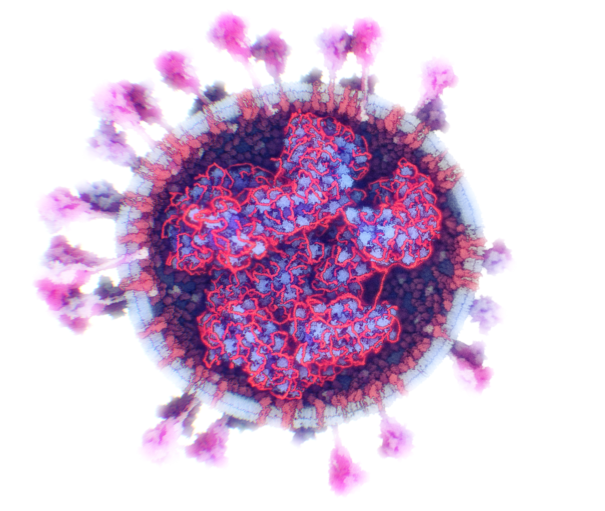

# Mesoscale Modeling
Internal nucleoprotein complex | RNA condensed within the nucleoprotein | Outer spike distribution
:-------------------------:|:-------------------------:|:-------------------------:
 |  | 

## People
- [Ngan Nguyen](mailto:ngan.nguyen@kaust.edu.sa)
- [Ondřej Strnad](mailto:ondrej.strnad@kaust.edu.sa)
- [Ivan Viola](mailto:ivan.viola@kaust.edu.sa)

## Description
Modeling and visualization of the cellular mesoscale -the scale level bridging the nanoscale of atoms and molecules with the microscale of cells -is necessarily an integrative process, since there are no existing experimental methods for directly observing the mesoscale structure of cells. Mesoscale studies integrate information from microscopy, structural biology, and bioinformatics to generate representative models consistent with the current state of knowledge. Challenges that are currently limiting the integrative modeling pipeline include (a) finding and curating disparate sources of data, and (b) constructing and visualizing intuitive 3D models of this size and complexity with reasonable user and computational effort. We aim to address the latter challenge in this project.  

## Publications
- Ngan Nguyen, Ondrej Strnad, Tobias Klein, Ruwayda Alharbi, Peter Wonka, Martina Maritan, Peter Mindek, Ludovic Autin, David Goodsell, Ivan Viola.

    [Modeling in the Time of COVID-19: Statistical and Rule-based Mesoscale Models](https://arxiv.org/abs/2005.01804)

    <em>IEEE Transactions on Visualization and Computer Graphics, 2020</em>
## Links